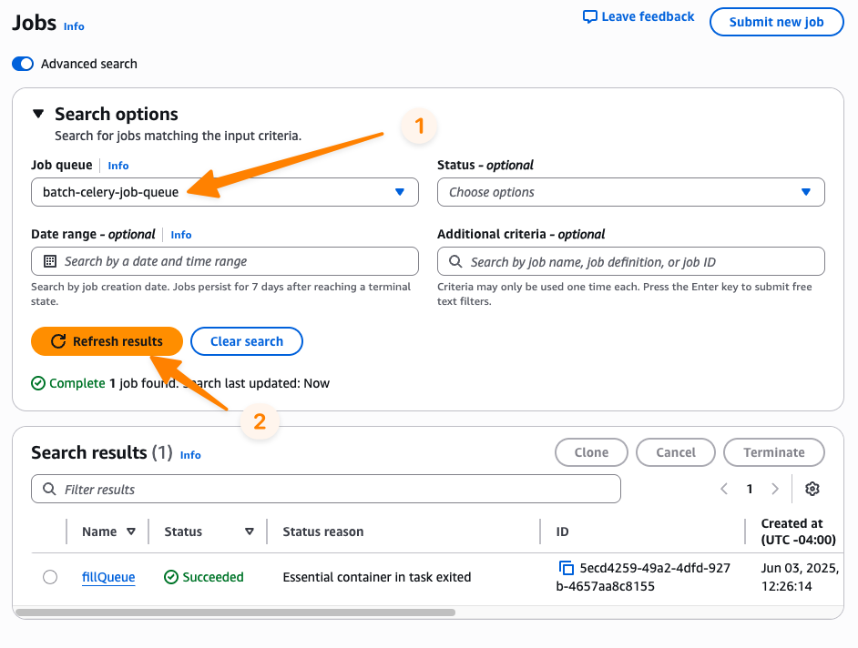

# Welcome to the AWS Batch Celery Example CDK Python project!

This project leverages the  [AWS CDK for Python](https://docs.aws.amazon.com/cdk/v2/guide/work-with-cdk-python.html) to define and manage the infrastructure. 

In order to run this example, you will need to be able to install and leverage CDK for Python, as well as build Docker containers. 

The easiest path to do so is to leverage AWS Cloud9, an integrated development environment accessible within the AWS Management Console. You can follow the [Getting started guide for AWS Cloud9](https://docs.aws.amazon.com/cloud9/latest/user-guide/tutorial.html) instructions to bootstrap a Cloud9 environment that will work with this example. 

### Setting up CDK and the project

Once you have a Cloud9 environment (or other development environment that is able to deploy CDK stacks and build Docker containers), open a Terminal window and check out this repository, then navigate to the contained CDK project directory: 

```bash
git clone https://github.com/aws-samples/aws-batch-celery-example.git
cd aws-batch-celery-example/cdk-project
```

The `cdk.json` file tells the CDK Toolkit how to execute your app.

This project is set up like a standard Python project.  We highly recommend that you create a Python virtualenv within this project, stored under the `.venv` directory to intall CDK and other Python modules specific to this project. To manually create a virtualenv in the Cloud9 terminal:

```bash
$ python3 -m venv .venv
```

After the init process completes and the virtualenv is created, you can use the following step to activate your virtualenv.

```bash
$ source .venv/bin/activate
```

Once the virtualenv is activated, you can install the required dependencies.

```
$ pip install -r requirements.txt
```

At this point you can now synthesize the CloudFormation template for this code.

```
$ cdk synth
```

### Useful CDK commands

Here are some useful CDK commands for reference:

 * `cdk ls`          list all stacks in the app
 * `cdk synth`       emits the synthesized CloudFormation template
 * `cdk deploy`      deploy this stack to your default AWS account/region
 * `cdk diff`        compare deployed stack with current state
 * `cdk docs`        open CDK documentation


## Deploying the example infrastructure and running the 

To deploy the stack to your AWS account: 

```bash
cdk deploy
```

You'll get a notice about needing elevated permissions to create the IAM roles. Accept the statement to create the resources. Once the stack deploys successfully, note the following `Outputs` values from the stack:

* `BatchJobQueueArn` - the create AWS Batch job queue ARN 
* `BatchCeleryFillQueueJobDefArn` - the created AWS Batch job definition for creating the Celery tasks for Celery workers to process. 

## Running the example

Once the stack is deployed, you can issue the following command via the Cloud9 terminal to populate the SQS queue with 10 Celery tasks requests, using the values for  `BatchJobQueueArn` and `BatchCeleryFillQueueJobDefArn`. 

You can change the value of `numMessages` to >=50 to trigger the "high" CloudWatch alarm and EventBridge rule that submits a Batch array job starting multiple Celery workers.

```bash
aws batch submit-job --job-name "fillQueue" \
  --job-queue "<BatchJobQueueArn>" \
  --job-definition "<BatchCeleryFillQueueJobDefArn>" \
  --parameters "numMessages=10" 
```

To view the status of the job:

1. Navigate to the [AWS Batch management console](https://console.aws.amazon.com/batch/home)
2. On the left-hand side, select the **Jobs** tab, then for job queue select the **batch-celery-job-queue**



To view the status of the Amazon CloudWatch Alarms: 

1. Navigate to the [Amazon CloudWatch management console](https://console.aws.amazon.com/batch/home)
2. On the left-hand side, select **All alarms, then enter "**BatchFargateStack**" into the filter. You should see the alarms in **OK** state. 


If the `fillQueue` job completed, then either one or both alarms may be in alarm state, depending if you defined less than or greater than 50 Celery messages to be inserted into the SQS queue. 


When the alarm enters ALARM state, the EventBridge rule(s) will submit jobs to Batch to start Celery workers. These requests will show up in the Batch console as well


## Cleaning up

To clean up your resources and avoid unnessecary charges, leverage CDK to tear down the CloudFormation stacks using the following command: 

```bash
cdk destroy BatchCeleryFargateStack
```
